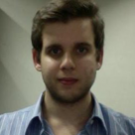

PHP Experience 2017
===

  

O maior evento de PHP do Brasil
-

(25, 27 e 28/03/2017)

---

Objetivo
===

- Nível técnico das palestras/palestrantes
- Impressões pessoais sobre o evento
- Porque você deve participar

---

Keynote Speakers (dia 27/03)
===

 Marco Pivetta

 Alex Ciunciusky

 Esteban Garcia

 Michelangelo Van Dam

---

Leveraging a distributed architecture to your advantage
===

 

(Alavancando uma arquitetura distribuida em seu favor)
(Ou vantagens de uma arquitetura distribuída)
(Ou ...)

---

 - Gostamos do que é mais fácil
 	- de manter, distribuir, proteger
 	- dá menos dor de cabeça (no início)

---

---

---

 - Prepare seu código para escalar e redistribuir

---

 - Quando o 100% online é importante, muitos providers serao necessarios

---

 - Teste seu sistema contra falhas. Se der pau hoje, o backup funciona?

 ---
 
 - Seu cliente toparia ter sua aplicação rodando, de forma limitada, mas 100% online?
---

 Automatize o deploy e "aqui tem coragem"
 -
 
  

 

---

Netflix Simian Army
=

https://github.com/Netflix/SimianArmy/wiki

---

Compartilhando qualidade e conhecimento com Code Review
===
(Antonio Spinelli)
-

---

Historia do htop, um making of
===

- Hisham Muhammad 
	- Doutorando, PUC-Rio
	- Lead Developer do LuaRocks

---

O HTOP surgiu a partir de duas necessidades: 
===

- A de aprender C
- Um scroll no "top"

---

Curiosidades sobre o htop
--

- /proc + ncurses (linprocfs)
- Funcionava bem nos primeiros releases

---

O jogo virou quando...
===

Começaram os PRs com ports (FreeBSD, OSX)

- Código "pesado" de se manter
- Um refactoring era inevitável

---

- Buscou torná-lo "portável" separando os codebases
	- Linux
	- FreeBSD
	- Unsupported

---

O sucesso foi tão grande que apareceu nas TVs do mundo

---

---

A comunidade exerceu papel essencial no projeto
===
(E você pode contribuir também)

https://github.com/hishamhm/htop

---

 Inteligência Artificial e Redes Neurais em PHP
 	- Gabriel Couto - Chefe de Arquitetura de Software, Memed

Redes Neurais

http://cs.stanford.edu/people/karpathy/convnetjs/

https://github.com/gabrielrcouto/php-svm
https://github.com/gabrielrcouto/php-simple-neural-network
https://github.com/gabrielrcouto/php-computer-vision

---

Mas e aí, porque devo participar desses eventos? 
==

  

É legal saber o que os outros estão fazendo
--

---

Trocar idéias*, experiências, etc
---
- Como você resolveu problema X
- "Estou com um problema Y que..."
- Tenho um projeto pessoal que precisa de ajuda...

  

'* *Sem citar clientes, ok?*

---

Ver gente que você nem imaginaria que iria conhecer um dia
==

*(Tipo o Rasmus Lerdorf)*

---

O PHP é uma das poucas linguagens que é "100% comunidade"
==
*(Ou quase)*

---

Como participar?
===

http://phpsp.org.br

---

---

Perguntas? 
===

---

Obrigado!
===

   

Gustavo Pereira
gpereira@mt4.com.br

--- 
Referências 
---
*Imagens, slides, etc* 

http://phpexperience.com.br
http://twitter.com/gabrielrcouto
http://twitter.com/jucycabrera
https://www.slideshare.net/DragonBe/leveraging-a-distributed-architecture-to-your-advantage-73741487
http://hisham.hm/htop/
https://github.com/gabrielrcouto
https://github.com/php-wpi/about
http://phpsp.org.br

